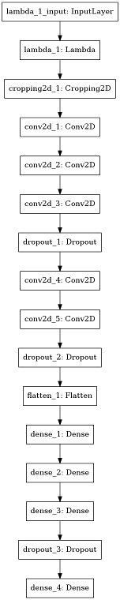
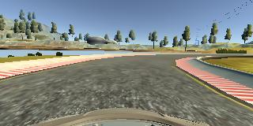
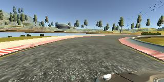
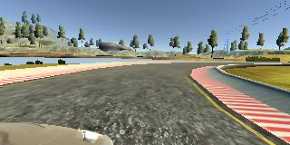
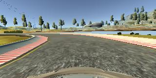
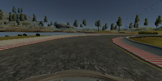

#**Behavioral Cloning** 

The goals / steps of this project are the following:
- Use the simulator to collect data of good driving behavior
- Build, a convolution neural network in Keras that predicts steering angles from images
- Train and validate the model with a training and validation set
- Test that the model successfully drives around track one without leaving the road
- Summarize the results with a written report

---
###Files Submitted & Code Quality

####1. Submission includes all required files and can be used to run the simulator in autonomous mode

My project includes the following files:
- ```training_model.py``` containing the script to create and train the model
- ```drive.py``` for driving the car in autonomous mode
- ```model.h5``` containing a trained convolution neural network 
- ```P3_writeup.md``` summarizing the results

####2. Submission includes functional code
I have used the data that Udacity provided, along with the simulator simulator and my drive.py file, the car can be driven autonomously around the track by executing 
```sh
python drive.py model.h5
```

####3. Submission code is usable and readable

The ```training_model.py``` file contains the code for training and saving the convolution neural network. The file shows the pipeline I used for training and validating the model.

###Model Architecture and Training Strategy

####1. An appropriate model architecture has been employed

My model is based on the NVIDIA "End to End Learning for Self-Driving Cars" paper consists of a convolution neural network with 5x5 filter sizes and depths between 24 and 48 (code lines 90-92) 

The model includes ELU layers to introduce nonlinearity, and the data is normalized in the model using a Keras lambda layer (code line 88).

Afterwards, two convolutional layers of 64 depth and 3x3 filter size (code lines 94-95). Finally, a flatten layer followed by four fully connected layers (code lines 97-102).

####2. Attempts to reduce overfitting in the model

The model contains dropout layers in order to reduce overfitting (cod lines 93, 96, and 101). 

The model was trained and validated on the Udacity data set to ensure that the model was not overfitting. The model was tested by running it through the simulator and ensuring that the vehicle could stay on the track.

####3. Model parameter tuning

The model used an adam optimizer, even though the learning rate was tuned manually (about 0.0001) (code line 104). I know that the learning rate is not required to tune using adam optimizer, but left it as a starting point.

####4. Appropriate training data

Because of lack of a steereing weel or a joystick, and being bad playing video games, I used the data Udacity provided.

For details about how I created the training data, see the next section. 

###Model Architecture and Training Strategy

####1. Solution Design Approach

My first step was to use a convolution neural network model similar to the model proposed by Nvidia in their paper "End to End Learning for Self-Driving Cars". I considered this model would be a good starting point because it has been demonstrated to be effective using 3 images sources for training the network, having effective results.

In order to gauge how well the model was working, I split my image and steering angle data into a training and validation set. I found that my first model had a low mean squared error on the training set but a high mean squared error on the validation set. This implied that the model was overfitting. 

To combat the overfitting, I modified the model including dropout layers at 20% after the first 3 convolution layers, 50% after the following 2 convolution layers, and 50% after the three connected layers.

Then I realize that the model was not performing well, becuase I was not pre-processing the images in the training phase. Hence, I provided a random brightness to the images before flipping it and feed the trainer.

The final step was to run the simulator to see how well the car was driving around track one. Although the vehicle makes many corrections from the left and right sides, the performance at the end is good enough.

At the end of the process, the vehicle is able to drive autonomously around the track without leaving the road.

####2. Final Model Architecture

The final model architecture (```training_model.py``` lines 87-102) consisted of a convolution neural network with the following layers and layer sizes:

| Layer (type)                       | Output Shape            | Param # |
| --------------------------------- | :-------------------------: | -----------: |
| lambda_1 (Lambda)            | (None, 160, 320, 3) |             0 |
| cropping2d_1 (Cropping2D) | (None, 65, 320, 3)  |             0 |
| conv2d_1 (Conv2D)             | (None, 31, 158, 24)|        1824 | 
| conv2d_2 (Conv2D)             | (None, 14, 77, 36)  |      21636 |
| conv2d_3 (Conv2D)             | (None, 5, 37, 48)    |      43248 |
| dropout_1 (Dropout)            | (None, 5, 37, 48)    |              0 |
| conv2d_4 (Conv2D)             | (None, 3, 35, 64)    |      27712 |
| conv2d_5 (Conv2D)             | (None, 1, 33, 64)    |      36928 |
| dropout_2 (Dropout)            | (None, 1, 33, 64)    |              0 |
| flatten_1 (Flatten)                | (None, 2112)          |             0 |
| dense_1 (Dense)                  | (None, 100)            |   211300 |
| dense_2 (Dense)                  | (None, 50)              |       5050 |
| dense_3 (Dense)                  | (None, 10)              |         510 |
| dropout_3 (Dropout)            | (None, 10)              |              0 |
| dense_4 (Dense)                  | (None, 1)               |            11 |

Here is a visualization of the architecture:



####3. Creation of the Training Set & Training Process

As explained before, I used the data given by Udacity. Here is an example image of center lane driving:

 

I also included the left and right images in order to give additional data to the network. A sample for them can be seen below, at the same timestamp as the center image shown before:

 
 

Then, I also flipped images and angles to reduce the tendency of turning to the left (direction of the lap course). For example, here is an image that has then been flipped:

 

Also a random brightness was introduced to each image, in order to make the network more robust:

 

I finally randomly shuffled the data set and put 20% of the data into a validation set.

I used this training data for training the model. The validation set helped determine if the model was over or under fitting. I settled as 10 the number of epochs, with an early ending process after 2 epochs without improvement. This is the epoch result of the network training.

```sh
Epoch 1/10
1206/1205 [=======] - 88s - loss: 0.0368 - val_loss: 0.0269
Epoch 2/10
1206/1205 [=======] - 87s - loss: 0.0296 - val_loss: 0.0254
Epoch 3/10
1206/1205 [=======] - 86s - loss: 0.0277 - val_loss: 0.0249
Epoch 4/10
1206/1205 [=======] - 86s - loss: 0.0272 - val_loss: 0.0241
Epoch 5/10
1206/1205 [=======] - 86s - loss: 0.0266 - val_loss: 0.0233
Epoch 6/10
1206/1205 [=======] - 86s - loss: 0.0264 - val_loss: 0.0236
Epoch 7/10
1206/1205 [=======] - 86s - loss: 0.0262 - val_loss: 0.0249
Epoch 8/10
1206/1205 [=======] - 86s - loss: 0.0258 - val_loss: 0.0234
```
