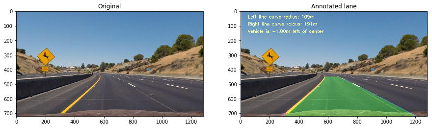

##Advanced Lane Finding Project

The goals / steps of this project are the following:

* Compute the camera calibration matrix and distortion coefficients given a set of chessboard images.
* Apply a distortion correction to raw images.
* Use color transforms, gradients, etc., to create a thresholded binary image.
* Apply a perspective transform to rectify binary image ("birds-eye view").
* Detect lane pixels and fit to find the lane boundary.
* Determine the curvature of the lane and vehicle position with respect to center.
* Warp the detected lane boundaries back onto the original image.
* Output visual display of the lane boundaries and numerical estimation of lane curvature and vehicle position.

###Writeup / README

####1. Provide a Writeup / README that includes all the rubric points and how you addressed each one.  You can submit your writeup as markdown or pdf. 

You're reading it!

###Camera Calibration

####1. Briefly state how you computed the camera matrix and distortion coefficients. Provide an example of a distortion corrected calibration image.

The code for this step is contained in the 2nd and 3rd code cells of the jupyter notebook located in "./P4_ALF.ipynb" 

The preparation of "object points", which will be the (x, y, z) coordinates of the chessboard corners in the world. It is assumed that the chessboard is fixed on the (x, y) plane at z=0, such that the object points are the same for each calibration image.  Thus, `objp` is just a replicated array of coordinates, and `obj_pnts` will be appended with a copy of it every time the routine detects all chessboard corners in a test image.  `img_pnts` will be appended with the (x, y) pixel position of each of the corners in the image plane with each successful chessboard detection.

The output `obj_pnts` and `img_pnts` are used to compute the camera calibration and distortion coefficients using the `cv2.calibrateCamera()` function.  This distortion correction is applied to the test image using the `cv2.undistort()` function and obtained this result: 

 

###Pipeline (single images)

####1. Provide an example of a distortion-corrected image.
This test picture was corrected due distorsion, using the parameters obtain from camera calibration, described in previous step (see 4th code cell):
 

####2. Describe how (and identify where in your code) you used color transforms, gradients or other methods to create a thresholded binary image.  Provide an example of a binary image result.
The combination of color and gradient thresholds to generate a binary image (thresholding steps at boxes 6 and 7).  Here's an example of my output for this step.
 

####3. Describe how (and identify where in your code) you performed a perspective transform and provide an example of a transformed image.

The code for my perspective transform includes a function called `PerspTransf(src, dst)`, which appears in the 5th code cell of the jupyter notebook).  The `PerspTransf(src, dst)` function takes as inputs the source (`src`) and destination (`dst`) points.  I chose the hardcode the source and destination points as follows:

| Source        | Destination   | 
|:-------------:|:-------------:| 
| 300, 720      | 300, 720        | 
| 580, 450      | 300, 0      |
| 730, 450     | 1100, 0      |
| 1100, 720      | 1100, 720        |

The resultant perspective image is shown below:
 

####4. Describe how (and identify where in your code) you identified lane-line pixels and fit their positions with a polynomial?

The code can be seen in the 8th and 9th cell of the jupyter notebook. First, the selection of windows to search non-zero pixels in the binary warped image. Those pixels indices are stored in order to interpolate them using a 2nd order polynomia. The result in the sample image is the following:
 

####5. Describe how (and identify where in your code) you calculated the radius of curvature of the lane and the position of the vehicle with respect to center.

The radius of curvature was estimated for both left and right lines. For the vehicle's position from the center of the lane the horizontal distance between the lines divided by two is compared to the horizontal midpoint of the whole frame. This can be seen in cells 11 and 12 from the jupyter notebook.

####6. Provide an example image of your result plotted back down onto the road such that the lane area is identified clearly.

The annotated image is performed by the 13 and 14 code cells from the jupyter notebook.  Here is the result on the test image taken as example:

 

---

###Pipeline (video)

####1. Provide a link to your final video output.  Your pipeline should perform reasonably well on the entire project video (wobbly lines are ok but no catastrophic failures that would cause the car to drive off the road!).

The pipeline for the project video can be found on the 16th code cell of the jupyter notebook. Here's a [link to my video result](./project_video_result.mp4)

---

###Discussion

####1. Briefly discuss any problems / issues you faced in your implementation of this project.  Where will your pipeline likely fail?  What could you do to make it more robust?

This pipeline works pretty well on the project video. However, I think there is not robustness enough for either the highway paving is too bright (challenge video) or sudden changes in light conditions (harder challenge video). At least brightness equalization and enhancing techniques for the color detection are required to be furtherly examined.

In the case the lines can be detected in all the frames, the line interpolation can be ensured just to only those pixels related to the lane lines. When spurious pixels appears in the regions close to the lines, they can be counted as valid and the polynomial fit can be erroneous. Maybe, an enhanced line detector plus an eroded procedure to the binary image can help to reduce the "false positives" in the line function estimation.

