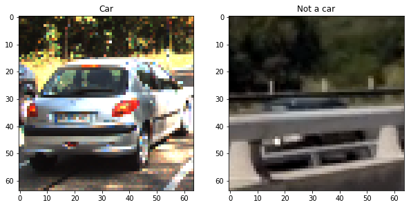
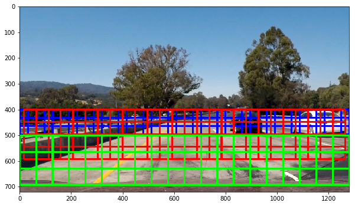
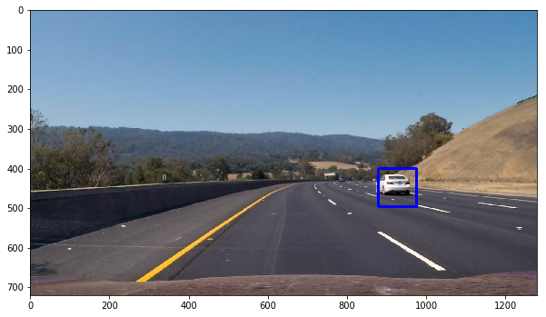

##Writeup Template
###You can use this file as a template for your writeup if you want to submit it as a markdown file, but feel free to use some other method and submit a pdf if you prefer.

---

**Vehicle Detection Project**

The goals / steps of this project are the following:

* Perform a Histogram of Oriented Gradients (HOG) feature extraction on a labeled training set of images and train a classifier Linear SVM classifier
* Optionally, you can also apply a color transform and append binned color features, as well as histograms of color, to your HOG feature vector. 
* Note: for those first two steps don't forget to normalize your features and randomize a selection for training and testing.
* Implement a sliding-window technique and use your trained classifier to search for vehicles in images.
* Run your pipeline on a video stream (start with the test_video.mp4 and later implement on full project_video.mp4) and create a heat map of recurring detections frame by frame to reject outliers and follow detected vehicles.
* Estimate a bounding box for vehicles detected.

[//]: # (Image References)
[image1]: ./examples/car_not_car.png
[image2]: ./examples/HOG_example.jpg
[image3]: ./examples/sliding_windows.jpg
[image4]: ./examples/sliding_window.jpg
[image5]: ./examples/bboxes_and_heat.png
[image6]: ./examples/labels_map.png
[image7]: ./examples/output_bboxes.png
[video1]: ./project_video.mp4

## [Rubric](https://review.udacity.com/#!/rubrics/513/view) Points
###Here I will consider the rubric points individually and describe how I addressed each point in my implementation.  

---
###Writeup / README

####1. Provide a Writeup / README that includes all the rubric points and how you addressed each one.  You can submit your writeup as markdown or pdf. 

You're reading it!

###Histogram of Oriented Gradients (HOG)

####1. Explain how (and identify where in your code) you extracted HOG features from the training images.

First of all, I created a list with the file names of all the `vehicle` and `non-vehicle` images.  Here is an example of one of each of the two classes:

 

I then explored different color spaces and different `skimage.hog()` parameters (`orientations`, `pixels_per_cell`, and `cells_per_block`).  I grabbed random images from each of the two classes and displayed them to get a feel for what the `skimage.hog()` output looks like. The code for this step is contained in the 3rd code cell of the jupyter notebook, as well as the 6th code cell, when the method `extract_features()` allow to get the HOG features based on different parameters like the color space, the number of orientations, the number of pixels per cell and the number of cells per block.

For instance, there is an HOG feature example, for each car and non-car classes, using the `gray` color space and HOG parameters of `orientations=9`, `pixels_per_cell=(8, 8)` and `cells_per_block=(2, 2)`:

 

####2. Explain how you settled on your final choice of HOG parameters.

As explained before, different parameters are used in order to get the HOG features. After different iterations, I chose the following configuration:

- Color Space: YCrCb
- Orientations: 9
- Pixels per cell: 8
- Cells per block: 2
- Channel: ALL

This configuration selection was based on the accuracy obtained by the SVM classifier (which will be explained in the next section), additionally to the speed of detection. For instance, each feature vector has a length of 5292 elements. The bigger the feature, the slower the execution of the detector.

####3. Describe how (and identify where in your code) you trained a classifier using your selected HOG features (and color features if you used them).

After the extraction of the features, the training of a Support Vector Machine (SVM) classifier was performed. This can be seen on the 7th and 8th code cells of the Jupyter notebook. However, for this project I did not use either the spatial binning, or the color histogram to be concatenated to the HOG features. Although they can improve the performance of the detector, I decided to have a light version of the routine. Further routine improvement must be done.

Additionally, the training of of a linear SVC was possible using the data provided, shuffled and splited 80/20. The latter was separated in order to validate the classifier. The accuracy obtained used the proposed configuration was about 98,14%.

###Sliding Window Search

####1. Describe how (and identify where in your code) you implemented a sliding window search.  How did you decide what scales to search and how much to overlap windows?

The code for the sliding window search is enclosed in cells 9th and 10th of the notebook. Based on the recommendation of the lesson, I selected the image's search area from the 400 pixels in height up to the end of the image (wipe out the image above the horizon), and using the whole width of the image. Because of size change of the vehicles in the image, I used three different window size (64x64, 96x96 and 128x128 pixels) for far, medium and close range, respectively. Furthermore, the overlapping of 50% gave reasonable results, but further experimentation is necessary. Here there is a test image showing the search area with the windows and the different sizes proposed.

 

####2. Show some examples of test images to demonstrate how your pipeline is working.  What did you do to optimize the performance of your classifier?

Here are the outcome of the window search pipeline on the some example images (code in cell 12 of the notebook):

 
 

---

### Video Implementation

####1. Provide a link to your final video output.  Your pipeline should perform reasonably well on the entire project video (somewhat wobbly or unstable bounding boxes are ok as long as you are identifying the vehicles most of the time with minimal false positives.)
Here's a [link to my video result](./project_video_output.mp4)

####2. Describe how (and identify where in your code) you implemented some kind of filter for false positives and some method for combining overlapping bounding boxes.

With the obtained windows detected, a heatmap was created in order to filter false positives.  Given a certain threshold to the heatmap, the identified vehicle positionswere labeld using the function `scipy.ndimage.measurements.label()`.  The assumed blobs corresponded to a vehicle, which a new bounding box was created to enclose the blob area. The corresponding codes can be found on the cells 13-16 of the jupyter notebook.

The following images show the heatmap applied to a test image, and consequent labeling after thresholding.

### Here the resulting bounding boxes are drawn onto the test image, showing the success of the vehicle detector routine:

---

###Discussion

####1. Briefly discuss any problems / issues you faced in your implementation of this project.  Where will your pipeline likely fail?  What could you do to make it more robust?

Although it is possible to obtain high accuracy values with different HOG parameters, it is not possible to reject the non-car detections as valid outcome. Additionally, an increase in the window overlapping can help to improve the detection. Ussing an additional feature may help to achieve better detection, having as a penalty the reduction in the routine's speed.

This pipeline works pretty well in the good lighting conditions shown in the video, but other videos with variation in illumination/weather may provoke the routine to fail. 

A tradeoff in accuracy detection and detection speed should be made in order to employ the code in real-time applications.  Finally, using a CNN method in order to avoid the window sliding search procedure (possibly a bigger training database is required).