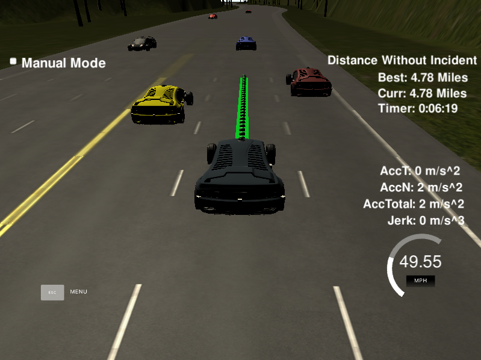

# CarND-Path-Planning-Project
Self-Driving Car Engineer Nanodegree Program
   
## Compilation
### The code compiles correctly
There were no significant changes to the repository's original configuration. A header file was added, ```spline.h```, which includes the implementation of a cubic spline interpolation. The latter helps to develop trajectories, instead of using polynomials. This was considered after a suggestion given at the project's walkthrough video.

## Valid Trajectories
### The car is able to drive at least 4.32 miles without incident
The car drove the minimum required (4.32 miles) without any incident.


### The car drives according to the speed limit
The car did not exceed the maximum velocity during the lapse.

### Max Acceleration and Jerk are not Exceeded
No red flags appeared regarding the maximum acceleration and jerk.

### Car does not have collisions
The car did not collide against any other vehicle.

### The car stays in its lane, except for the time between changing lanes
The car drives in its lane. The change between lanes does not exceed the 3-seconds window.

### The car is able to change lanes
The car can change lanes in safely way. If the car ahead is too close and there is an empty space in the adjacent lane, the car will change to that lane.

## Reflection
Taking as starter the code provided by the repository and the project's walkthrough video, the code for planning the according path is located at ```main.cpp``` file, between lines 246 and 416. I decided to have all the code in one place to avoid mistakes and handle all the variables easily. However, real life driving car would require different approaches due to the requirements.

### Prediction (lines 254-287)
This part of the code is the "understanding" of the environment around the car, using sensors information. The three situations to have in consideration are:

* Verification of a car in front of ours.
* Verification of a car in the right adjacent lane, if any.
* Verification of a car in the left adjacent lane, if any.

The estimation of the sensed cars' lane (d-coordinate) and position (s-coordinate) in the Frenet reference frame provide us the information about if a specified gap exists for safe driving, as well as for safe lane change in the case a car ahead is too close. This gap threshold was defined with 30 meters in front of the car and 10 meters behind it.

### Behavior (lines 289-305)
This section defines what the action of the car will be, based on the sensed environment at a certain epoch. The idea is to determine:

* Change of lanes based on the location of surrounding cars.
* Velocity reduction or augmentation, based on the previous premise.

The main purpose of the car is to drive safely at the maximum velocity possible, without exceeding the speed limit. Hence, the algorithm will look for empty gaps to change lanes safely without decreasing too much the velocity, if a car is in front of ours and too close. When the lane change is not possible, the car will reduce or increase its speed accordingly to the reference velocity.

### Trajectory (lines 307-417)
Finally, the determination of the driving path, based on the results of the prediction and behavior sections.

Taking into accoung the last two points of the previous trajectory (or the initial position if the car was not moving), are used with 3 points ahead in the horizon (30, 60 and 90 meters), in order to initialize a spline, which determines the trajectory to follow.

However, those points are estimated in global coordinates. For calculation easiness, the points are transformed into car local coordinates, in order to estimate the spline better, and then to re-transform those points again to global coordinates.